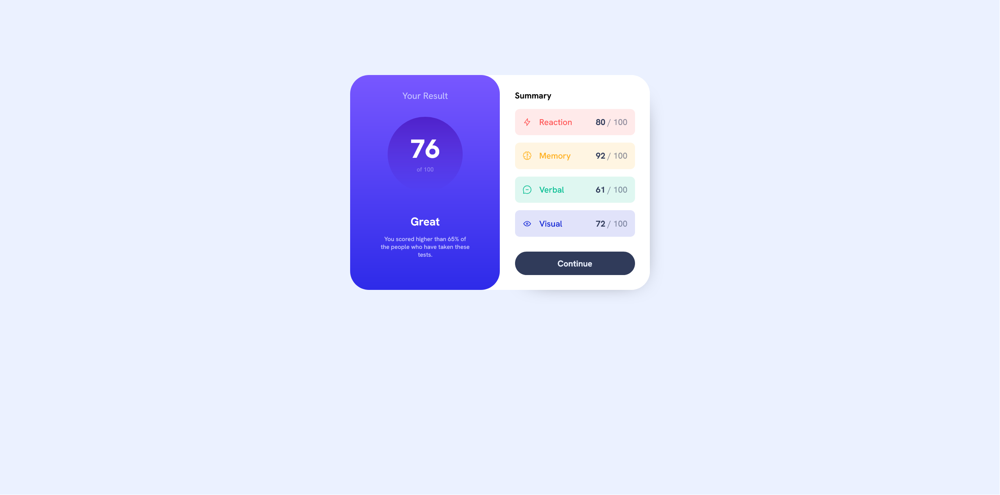

# Frontend Mentor - Results summary component solution

This is a solution to the [Results summary component challenge on Frontend Mentor](https://www.frontendmentor.io/challenges/results-summary-component-CE_K6s0maV). Frontend Mentor challenges help you improve your coding skills by building realistic projects. 

## Table of contents

- [Overview](#overview)
  - [The challenge](#the-challenge)
  - [Screenshot](#screenshot)
  - [Links](#links)
- [My process](#my-process)
  - [Built with](#built-with)
  - [What I learned](#what-i-learned)
  - [Continued development](#continued-development)
- [Author](#author)

## Overview

### The challenge

Users should be able to:

- View the optimal layout for the interface depending on their device's screen size
- See hover and focus states for all interactive elements on the page
- **Bonus**: Use the local JSON data to dynamically populate the content

### Screenshot

### Links

- Solution URL: [https://github.com/Alfonso-1701/Results_Summary](https://github.com/Alfonso-1701/Results_Summary)
- Live Site URL: [https://steady-cobbler-83d8bb.netlify.app](https://steady-cobbler-83d8bb.netlify.app)

## My process

Started with analyzing the different levels of content on the page. I looked to see how they connected to each other, having a small idea of how to best layout the markup. When doing the markup I took it piece by piece, questioning, how the piece interacted with those before and after it.  

### Built with

- Semantic HTML5 markup
- CSS custom properties
- Flexbox
- CSS Grid
- Mobile-first workflow

### What I learned

Really just came across making a circle you want to set the width and the height. Stacked some divs inside divs applying flex to them. While it wasn't as natural as I would like, there was definetely some comfort there. 

### Continued development

I feel like my workflow has become more regimented and organized. I also think my code is mostly organized. I would love to see what are some industry practices that I can implement to take it to the next level. 

## Author

- Website - [LinkedIn](https://www.linkedin.com/in/alfonso-alvarez-4223b628b/)
- Frontend Mentor - [@Alfonso-1701](https://www.frontendmentor.io/profile/Alfonso_1701)

